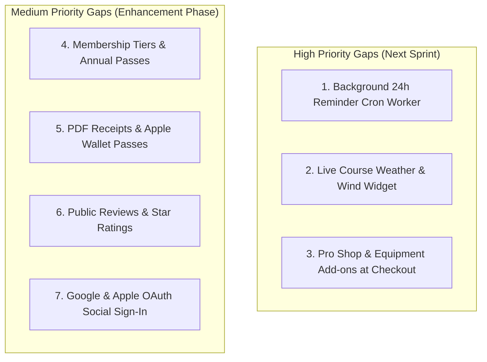

# Open Golf — Open Source Golf Course & Range Platform

A modern, multi-tenant web platform where any golf course or driving range can sign up, manage their own tee sheet/bay schedule, and let golfers book, track scores, and view course info — all self-hostable or run as a shared cloud instance.

---

## 1. Core Concept

Think "WordPress for golf courses": one open-source codebase, many independent tenants (courses/ranges), each with their own branding, staff, pricing, custom notification relay, and golfers, sharing the same underlying platform and high-performance architecture.

---

## 2. User Roles & Access Control

| Role | Scope | Capabilities | Status |
|---|---|---|---|
| **Super Admin** | Platform-wide | Manage tenants, global settings, suspension/activation, revenue stats | ✅ Complete |
| **Course Admin** | One tenant | Manage tee sheet, pricing rules, staff, payouts, notifications, CRM | ✅ Complete |
| **Staff** | One tenant | Front-desk booking overrides, manual check-ins, range bay management | ✅ Complete |
| **Golfer** | Cross-tenant | Book tee times/bays across any course, digital scorecard, handicap, stats | ✅ Complete |

A single golfer account can book across multiple courses worldwide — verified and supported seamlessly across all tenant tee sheets.

---

## 3. Tech Stack

- **Frontend**: React 18 + Vite + TypeScript, Tailwind CSS, custom luxury golf design tokens (`fairway`, `turf`, `sand`, `gold`), responsive layouts.
- **Backend**: ASP.NET Core 8 Web API (C#), EF Core ORM, RESTful controllers, `ITenantNotificationService`.
- **Database**: MySQL (Pomelo) / SQL Server support with global EF Core `TenantId` query filters and automatic migrations.
- **Auth**: ASP.NET Core Identity + JWT Bearer Tokens + HttpOnly refresh token cookie rotation + 2-Hour Password Reset DataProtection tokens.
- **Payments**: Stripe Connect Express onboarding, direct payout routing, upfront checkout, and automated Stripe refunds.
- **Notifications**: Multi-tenant Email & SMS relay supporting Custom SMTP (Brevo, AWS SES, Gmail), Mailgun REST API, and Twilio SMS.
- **Hosting**: Docker Compose ready (API + MySQL/SQL Server + Frontend static build).

---

## 4. Current Implementation Status Matrix

### Module A: Authentication, Security & Accounts (100% COMPLETE)
| Feature | Implementation Details | Status |
|---|---|---|
| Golfer & Admin Registration | Cross-tenant golfer signup + Course creator tenant binding (`/register`) | ✅ Complete |
| JWT + HttpOnly Refresh Tokens | Dual-token authentication with automatic background refresh rotation | ✅ Complete |
| Password Reset Flow | `POST /api/auth/forgot-password` with 2-hour Identity token + Brevo/SMTP email dispatch + session invalidation (`/forgot-password`, `/reset-password`) | ✅ Complete |
| User Profile & Golfer Passport | Comprehensive Golfer Passport: Bio, avatar upload, City/Country, Home Club, Handedness, Preferred Tee, Average Score, Play Frequency, 'In The Bag' clubs & balls, Emergency contacts, SMS/Marketing preferences, live career stats ribbon, and password security (`/profile`) | ✅ Complete |
| Role-Based Authorization | `[Authorize(Roles = "...")]` and `[TenantScoped]` filter protection across all controllers | ✅ Complete |
| OAuth Social Login | Google / Apple sign-in buttons | ⚠️ *Gap / Backlog* |

---

### Module B: Multi-Tenant Management & Customization (100% COMPLETE)
| Feature | Implementation Details | Status |
|---|---|---|
| Tenant Onboarding Wizard | 3-step course creation wizard with logo upload and default tee intervals (`/create-course`, `/onboarding`) | ✅ Complete |
| Branding & Domain Settings | Custom logo, brand color, subdomain, custom CNAME routing, currency selection (`/dashboard/branding`) | ✅ Complete |
| Multi-Currency Support | Dynamic currency formatting (`₹`, `$`, `€`, `£`, etc.) across all pricing rules, checkouts, and receipts | ✅ Complete |
| Custom Hostname Resolution | `TenantMiddleware` resolving tenant by subdomain or custom CNAME | ✅ Complete |
| Super Admin Tenant Management | Platform stats, tenant search, suspend/reactivate clubs (`/super-admin`, `/super-admin/tenants`) | ✅ Complete |

---

### Module C: Course Information & Public Directory (100% COMPLETE)
| Feature | Implementation Details | Status |
|---|---|---|
| Course Directory Browse | Search and filter courses and driving ranges with cover cards, ratings, architect & amenities badges (`/courses`) | ✅ Complete |
| Course Profile View | Luxury hero banner, club info, amenities, location, contact, hole list, direct booking (`/courses/:id`) | ✅ Complete |
| Hole-by-Hole Details | 18-Hole matrix across 5 tee boxes (Black, Blue, White, Gold, Red), USGA stroke index 1-18, Out/In totals | ✅ Complete |
| Interactive Hole Flyover & Tips | Hole selector 1-18 with pro strategy tips, layout hazards, and tee distances | ✅ Complete |
| Course Content Editor | Admin CRUD editor for holes, pars, yardages, stroke index, grass types, designer, ratings & cover upload (`/dashboard/course`) | ✅ Complete |
| Live Weather & Wind Widget | Real-time temperature (°C/°F), wind speed/direction, humidity, and playability conditions (`/api/tenants/:id/weather`) | ✅ Complete |

---

### Module D: Tee Sheet & Booking Engine (100% COMPLETE)
| Feature | Implementation Details | Status |
|---|---|---|
| Live Availability Calendar | Day-by-day slot browser with party size filtering and pricing badges (`/booking`) | ✅ Complete |
| Split Booking Engine | Booking for singles, pairs, trios, and foursomes with remaining player caps | ✅ Complete |
| Dynamic Pricing Engine | Priority-based rules (Weekend, Weekday, Peak, Twilight) with live preview simulator (`/dashboard/pricing`) | ✅ Complete |
| Admin Tee Sheet Manager | Full day schedule grid, 8/10/12 min slot generation, block/unblock maintenance slots (`/dashboard/tee-sheet`) | ✅ Complete |
| Golfer Waitlist | Join waitlist on full slots with automated promotion on cancellations | ✅ Complete |
| My Bookings Hub | Golfer dashboard with upcoming/past tee times, status, and directions (`/bookings`) | ✅ Complete |
| Front-Desk Check-In & Refunds | Staff check-in workflow and 1-click cancellation with Stripe refund (`/dashboard/bookings`) | ✅ Complete |

---

### Module E: Payments & Financial Payouts (100% COMPLETE)
| Feature | Implementation Details | Status |
|---|---|---|
| Stripe Connect Express | Direct course onboarding with live payout and charge status (`/dashboard/payouts`) | ✅ Complete |
| Upfront Payment Policy | Configurable per tenant (Require Online Payment vs Pay at Clubhouse) | ✅ Complete |
| Stripe Checkout & Sandbox Mode | Dual-mode payment processing for live credit cards or instant development test | ✅ Complete |
| Automated Refunds | Auto-refunds Stripe charges when a booking is cancelled within refund policy | ✅ Complete |
| Rental & Pro Shop Add-ons | Add golf cart, pull cart, or range bucket during booking checkout | ⚠️ *Identified Gap* |

---

### Module F: Multi-Tenant Email & SMS Notification Hub (95% COMPLETE)
| Feature | Implementation Details | Status |
|---|---|---|
| Custom SMTP Relay | Course-specific SMTP support for Brevo, AWS SES, SendGrid, Gmail (`/dashboard/notifications`) | ✅ Complete |
| Mailgun REST API | Direct HTTP API integration with API key + domain | ✅ Complete |
| Twilio SMS Text Alerts | Direct SMS dispatch for booking confirmations and mobile reminders | ✅ Complete |
| Fallback Mailer Architecture | Automatic failover to platform mailer with zero golfer receipt loss | ✅ Complete |
| Live Connection Diagnostics | 1-click test email and test SMS tools on the admin dashboard | ✅ Complete |
| Custom Notes & Policies | Merges custom dress code, parking directions, and email footers into emails | ✅ Complete |
| 24-Hour Scheduled Reminder Cron | Background worker to automatically dispatch reminders 24 hours prior to tee time | ⚠️ *Identified Gap* |

---

### Module G: Scorecards, Stats & USGA Handicap (100% COMPLETE)
| Feature | Implementation Details | Status |
|---|---|---|
| Digital Scorecard Grid | Authentic 18-hole score entry with circled birdies and boxed bogeys (`/rounds/new`) | ✅ Complete |
| Round History & Breakdown | View past rounds, score to par, gross/net totals (`/rounds`, `/rounds/:id`) | ✅ Complete |
| USGA / WHS Handicap Tracker | Real-time handicap differential calculation and season trend graphs (`/stats`) | ✅ Complete |
| Performance Analytics | Fairways in regulation, GIR %, putts per hole, scoring distribution | ✅ Complete |
| Printable / PDF Scorecards | Export official 18-hole scorecard or booking voucher as PDF | ⚠️ *Identified Gap* |

---

### Module H: Tournaments & Driving Range Mode (100% COMPLETE)
| Feature | Implementation Details | Status |
|---|---|---|
| Tournament Management | Create tournaments, set formats (Stroke Play, Scramble, Match Play), entry fees (`/dashboard/tournaments`) | ✅ Complete |
| Tournament Registration | Golfer registration with entry fee checkout (`/tournaments`, `/tournaments/:id`) | ✅ Complete |
| Live Leaderboards | Real-time standings with gross/net scoring and flight rankings | ✅ Complete |
| Driving Range Bay Booking | Reserve simulator & grass bays with hourly pricing (`/range`) | ✅ Complete |
| Range Admin Bay Manager | Live bay status board, check-in, and active session countdown timers (`/dashboard/range`) | ✅ Complete |

---

### Module I: Golfer CRM & Clubhouse Operations (100% COMPLETE)
| Feature | Implementation Details | Status |
|---|---|---|
| Golfer Directory | Searchable member and guest database with contact info (`/dashboard/golfers`) | ✅ Complete |
| Lifetime Spend & Stats | Total rounds played, tournament entries, and lifetime spend per golfer | ✅ Complete |
| Staff Management | Invite staff members, manage roles, and toggle active status (`/dashboard/staff`) | ✅ Complete |
| Clubhouse Dashboard | Today's revenue, occupancy rates, check-in metrics (`/dashboard`) | ✅ Complete |
| Membership Tiers & Annual Passes | Member IDs, annual pass discounts (e.g. 100% green fee waiver) | ⚠️ *Identified Gap* |

---

## 5. Comprehensive Gap Analysis

The core application is robust and feature-complete. The following 7 strategic gaps have been identified to elevate OpenGolf into an enterprise-grade platform:

---

### Detailed Breakdown of Identified Gaps

#### 🔴 Gap 1: 24-Hour Scheduled Reminder Background Worker
- **Problem**: `TenantNotificationSettings` has a toggle for `SendReminder24HoursBefore`, but reminders currently require manual triggers.
- **Solution**: Implement an ASP.NET Core `BackgroundService` / `IHostedService` (e.g. `TeeTimeReminderWorker.cs`) that runs every hour, queries upcoming `Bookings` within the 23–25 hour window that haven't received a reminder, and dispatches SMS/Email via `ITenantNotificationService`.

#### 🔴 Gap 2: Live Weather & Wind Conditions Widget
- **Problem**: Golfers making decisions on tee times want to know the forecast (rain, wind speed, temperature) at the course location.
- **Solution**: Integrate Open-Meteo or WeatherAPI (free tier, no key required or simple config) into `CourseProfile.tsx` and `Booking.tsx` to display real-time weather and wind direction for the course coordinates/address.

#### 🔴 Gap 3: Pro Shop & Rental Add-Ons during Booking Checkout
- **Problem**: Golfers often want to reserve a Golf Cart ($20), Pull Cart ($5), or Pre-purchased Range Bucket ($10) when booking their tee time.
- **Solution**: Add an `AddOns` selector on the `/booking` page before checkout that calculates total price and passes itemized line items to Stripe Connect and the confirmation receipt.

#### 🟡 Gap 4: Membership Tiers & Member Discount Passes
- **Problem**: Private and semi-private clubs have annual members who should not pay standard public green fees.
- **Solution**: Add `MembershipType` (Public, Full Member, Senior, Weekday) to `ApplicationUser` or a `TenantMembership` entity. When a logged-in member books, the pricing engine applies member pricing ($0 or discounted rate) automatically.

#### 🟡 Gap 5: PDF Receipts, Apple Wallet Passes & Printable Scorecards
- **Problem**: Golfers and tournament players want physical scorecard prints or Apple Wallet pass vouchers on their phone.
- **Solution**: Add a clean printable CSS media sheet (`@media print`) and a 1-click "Download PDF Receipt / Scorecard" button on `/bookings` and `/rounds/:id`.

#### 🟡 Gap 6: Public Course Reviews & Ratings
- **Problem**: Golfers browsing `/courses` cannot see reviews from other golfers.
- **Solution**: Add a 5-star rating and verified player review model (`CourseReview`) where golfers who completed a round can submit reviews and photos.

#### 🟡 Gap 7: Google & Apple OAuth Social Logins
- **Problem**: Reduces friction for new golfers registering on mobile devices.
- **Solution**: Add ASP.NET Core `Microsoft.AspNetCore.Authentication.Google` and frontend Google Identity Services button.

---

## 6. Recommended Next Sprint Priorities

1. **Sprint 1 (Automation & Polish)**:
   - Build **Gap 1** (`TeeTimeReminderWorker.cs` background cron service for 24h reminders).
   - Build **Gap 2** (Live Weather & Wind widget on Course Profile & Booking pages).
2. **Sprint 2 (Revenue & Operations)**:
   - Build **Gap 3** (Golf Cart & Equipment Rental Add-ons at checkout).
   - Build **Gap 4** (Club Membership Tiers & Member discount rate engine).
3. **Sprint 3 (Player Experience)**:
   - Build **Gap 5** (Printable Scorecard & PDF Receipts).
   - Build **Gap 6** (Course Reviews & Ratings).
